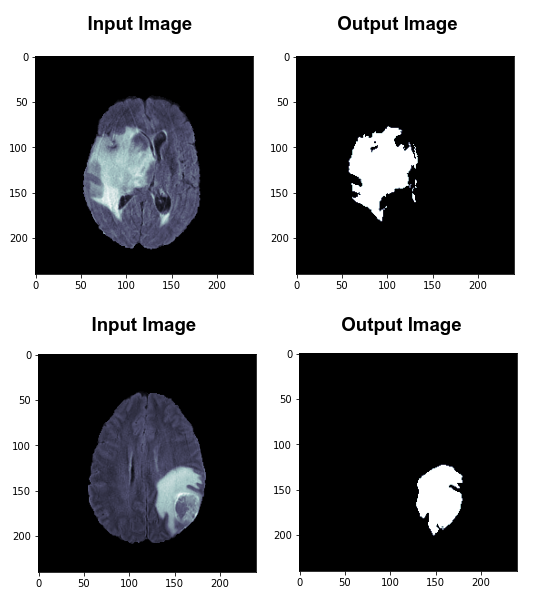
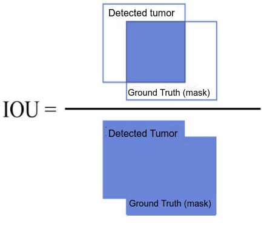

# MRI Brain Tumor Segmentation

### Students involved:

- Diany Pressato
- Matheus da Silva Araujo
- Maurilio da Motta Meireles
- Yure Pablo do Nascimento

## Abstract

As stated by <cite><a href="https://www.sciencedirect.com/science/article/abs/pii/S0730725X13001872">Nelly Gordillo et. al</a></cite> [1]:

<em>" The main
objective of image segmentation is to partition an image into
mutually exclusive regions such that each region is spatially
contiguous and the pixels within the region are homogeneous with
respect to a predefined criterion. This definition is in itself a major
limitation of most of the segmentation methods, especially when
defining and delineating “abnormal tissue types”, because the
tumors to be segmented are anatomical structures which are often
non-rigid and complex in shape, vary greatly in size and position,
and exhibit considerable variability from patient to patient. " </em>

### 1 - Main Objective

This project aims to segment brain tumor from magnetic resonance imaging (MRI) scans. This task involves separating the tumoral tissue from the normal gray matter and white matter tissues of the brain. 

The simplicity of the segmentation method and the degree of human supervision of the task is important for clinical acceptance in the field - for this reason, this project focuses more on interpretable and simple methods of segmentation than emphasizing "black box" techniques (such as Deep Learning). See [9] for more details on the unintended consequences of "black box" methods on medicine.

Tumor segmentation is considered a difficult task even when using state of the art techniques. In this poject, we aim to surpass the difficulties involved to obtain the best achievable result by using simple methods.

### Application

The application of this project is in medical imaging domain.

### 2 - Description of input images - BraTS Dataset

The chosen dataset is <cite><a href="https://www.med.upenn.edu/cbica/brats2020/data.html">BraTS2020</a></cite> [2, 3, 4, 5, 6, 7]. It is divided into three separate cohorts: Training, Validation, and Testing. The Training dataset
is composed of MRI scans from 369 diffuse glioma patients; glioma is considered a type of tumor. Each MRI volume is skull-stripped (the skull was extracted), and there are annotated masks for the tumors. The ground truth labels (masks) were provided by expert human annotators. 

The BraTS 2020 Validation cohort is composed of 125 cases of patients with diffuse
gliomas, and it is similar to the Training Dataset. The ground truth labels for the validation data are not provided. For this reason, we don't plan to use the Validation Dataset in this project. The Testing Dataset is only available to actual participants of the Multimodal Brain Tumor Segmentation Challenge 2020, and as such we don't have access to this cohort.

The publicly available BraTS2020 dataset is huge, occupying around 50 GB of disk space. It would require large computational resources (both in time and memory) to use the entire dataset on this project. For this reason, we opted to use a randomly selected subset of the entire dataset. On this partial report, we randomly selected five (5) MRI scans, as this small sample of scans allows us to experiment more quickly on a variety of image processing techniques, both in the pre-processing steps as in the segmentation itself. However, we emphasize that for the final report we will increase the number of samples to have a more realistic and comprehensive result in the challeging task of tumor segmentation.

### Input/Output Examples

Some examples of the input images and output images.

  |  

### 3 - Image Processing 

Our image processing pipeline can be described as follows:

1) Read input image

2) Histogram Equalization

3) Image Filtering (such as Gaussian, median or bilateral filters) to remove noise

4) Segmentation

5) Optional: post-processing using morphological operators to fill holes and remove small objects.

6) Segmentation evaluation using IOU (Intersection over Union) metrics.

The following diagram ilustrates our pipeline:

 

### Evaluation Metrics

Intersection over Union (IOU) is an evaluation metric used to measure the accuracy of an object detector, and it is commonly applied to segmentation task evaluation [8]. 

In this project, our main metric is IOU. The "segmented area" is defined as the segmentation image produced by our models. The "Ground Truth (mask)" is the mask provided by human annotation, contained in the BraTS2020 dataset.

IOU is defined as the interssection of "segmented area" and the "Ground Truth (mask)" area, divided by the union of both of those two areas:

  |  

### References

[1] Nelly Gordillo, Eduard Montseny, Pilar Sobrevilla,
State of the art survey on MRI brain tumor segmentation,
Magnetic Resonance Imaging,
Volume 31, Issue 8,
2013,
Pages 1426-1438,
ISSN 0730-725X,
https://doi.org/10.1016/j.mri.2013.05.002.

[2]https://www.med.upenn.edu/cbica/brats2020/data.html

[3] B. H. Menze, A. Jakab, S. Bauer, J. Kalpathy-Cramer, K. Farahani, J. Kirby, et al. "The Multimodal Brain Tumor Image Segmentation Benchmark (BRATS)", IEEE Transactions on Medical Imaging 34(10), 1993-2024 (2015) DOI: 10.1109/TMI.2014.2377694

[4] S. Bakas, H. Akbari, A. Sotiras, M. Bilello, M. Rozycki, J.S. Kirby, et al., "Advancing The Cancer Genome Atlas glioma MRI collections with expert segmentation labels and radiomic features", Nature Scientific Data, 4:170117 (2017) DOI: 10.1038/sdata.2017.117

[5] S. Bakas, M. Reyes, A. Jakab, S. Bauer, M. Rempfler, A. Crimi, et al., "Identifying the Best Machine Learning Algorithms for Brain Tumor Segmentation, Progression Assessment, and Overall Survival Prediction in the BRATS Challenge", arXiv preprint arXiv:1811.02629 (2018)

[6] S. Bakas, H. Akbari, A. Sotiras, M. Bilello, M. Rozycki, J. Kirby, et al., "Segmentation Labels and Radiomic Features for the Pre-operative Scans of the TCGA-GBM collection", The Cancer Imaging Archive, 2017. DOI: 10.7937/K9/TCIA.2017.KLXWJJ1Q

[7] S. Bakas, H. Akbari, A. Sotiras, M. Bilello, M. Rozycki, J. Kirby, et al., "Segmentation Labels and Radiomic Features for the Pre-operative Scans of the TCGA-LGG collection", The Cancer Imaging Archive, 2017. DOI: 10.7937/K9/TCIA.2017.GJQ7R0EF

[8] https://giou.stanford.edu/

[9] Cabitza F, Rasoini R, Gensini GF. Unintended Consequences of Machine Learning in Medicine. JAMA. 2017;318(6):517–518. doi:10.1001/jama.2017.7797